# TutorLoop

Multi-agent AI tutoring platform with teacher-in-the-loop oversight and
student memory. Phase 5-6 of a 30-day production AI/ML engineering roadmap
(see `30-day-ai-ml-roadmap-industry-portfolio.md` at the repo root), the
4th of 5 projects, following FleetPulse, GridScribe, and RxGround. Own git
repo, own virtual environment, separate from the other three.

Why this industry pairs with agents: tutoring is naturally multi-step
(assess, explain, quiz, adapt), naturally benefits from human oversight (a
teacher, not the AI, should own grading and parent communication), and
naturally needs memory (what does this student already know).

## Curriculum source

Every task that touches curriculum content (1, 3, 4) uses the same
subject and grade band for consistency: **OpenStax Prealgebra 2e**
(openstax.org, CC BY 4.0), a free, openly-licensed middle/early-high-school
math textbook. `task-1/curriculum/` holds adapted excerpts (not verbatim
full chapters) from three chapters: Solving Linear Equations, Fractions,
and Ratios & Proportions, chosen because they exercise the calculator tool
naturally and give the practice-problem generator real structure to work
from.

## Architecture

```mermaid
flowchart TB
    subgraph T1["Task 1: hand-rolled ReAct agent"]
        student1(("student\nquestion")) --> react["ReAct loop\n(Ollama)"]
        react --> tools1{"tool router"}
        tools1 --> curr1["curriculum_lookup()"]
        tools1 --> calc1["calculator()"]
        tools1 --> prac1["practice_problem()"]
    end

    subgraph T2["Task 2: LangGraph + human-in-the-loop"]
        student2(("student\nquestion")) --> fsm["LangGraph\nstate machine"]
        fsm --> checkpoint[("SQLite\ncheckpointer")]
        fsm --> hitl{"progress note\ndrafted?"}
        hitl -- yes --> pause(("pause,\nawait teacher"))
        pause --> approve(("teacher\napproves")) --> resume["resume from\nsaved state"]
    end

    subgraph T3["Task 3: multi-agent orchestration"]
        unit(("unit\nrequest")) --> planner["planner agent"]
        planner --> content["content agent"]
        planner --> quiz["quiz agent"]
        content --> coord["coordinator"]
        quiz --> coord
        coord --> lesson(("mini-lesson\n+ quiz"))
    end

    subgraph T4["Task 4: memory + RAG"]
        q4(("student\nquestion")) --> mem[("student memory\nSQLite")]
        q4 --> rag["Chroma retrieval\n(sentence-transformers)"]
        mem --> ground["grounded,\npersonalized answer"]
        rag --> ground
    end

    subgraph T5T6["Task 5-6: tracing + observability"]
        session(("tutoring\nsession")) --> otel["OpenTelemetry"]
        otel --> langfuse[("self-hosted\nLangfuse")]
        langfuse --> dash["latency / cost /\nerror-rate dashboards"]
    end

    subgraph T7["Task 7: online eval + shadow rollout"]
        live(("live\nsessions")) --> onlineeval["online eval\nscoring"]
        onlineeval --> dataset[("feedback\ndataset")]
        newprompt["candidate\nprompt"] --> shadow["shadow test\n(no real students)"]
        shadow -- pass --> rollout(("rollout"))
    end

    subgraph T8["Task 8: security + IAM"]
        attack(("jailbreak\nattempts")) --> guard["output filter +\nsystem-prompt guard"]
        tf["over-broad\nTerraform IAM role"] --> scan["checkov scan"]
        scan --> tighten["tightened role"]
        tighten --> floci[("Floci: SimulatePrincipalPolicy\n(live AccessDenied not\nenforced, community edition)")]
    end
```



## Tasks

| Task | Folder | What it is |
|---|---|---|
| 1 | [`task-1/`](./task-1) | Hand-rolled ReAct loop, no framework: curriculum-lookup, calculator, and practice-problem-generator tools over three OpenStax Prealgebra chapters, with a step limit and tool-error recovery |
| 2 | [`task-2/`](./task-2) | Same agent rebuilt as a LangGraph state machine with a SQLite checkpointer and a human-in-the-loop pause before a drafted teacher progress note "sends" |
| 3 | [`task-3/`](./task-3) | Planner/content/quiz/coordinator multi-agent system that turns a unit request into a coherent mini-lesson and aligned quiz, plus a written single-agent-vs-multi-agent analysis |
| 4 | [`task-4/`](./task-4) | Long-term student memory (SQLite) plus a proper Chroma + sentence-transformers RAG index over the OpenStax chapters, grounding new explanations and recalling past weak topics |
| 5 | [`task-5/`](./task-5) | Full tracing via self-hosted Langfuse, trajectory/tool-call/task-success evaluation, and a deliberately-broken session used to demonstrate root-causing a failure from its trace |
| 6 | [`task-6/`](./task-6) | OpenTelemetry instrumentation feeding the same self-hosted Langfuse, latency/cost/error-rate dashboards, and per-session thumbs-up/down feedback capture |
| 7 | [`task-7/`](./task-7) | Online eval scoring of live sessions, a feedback-to-dataset loop, and shadow-testing a candidate tutoring prompt before it reaches a real session |
| 8 | [`task-8/`](./task-8) | Red-teaming the "just give me the answer" jailbreak plus general prompt injection/output filtering, then a Terraform IAM least-privilege exercise against Floci: over-broad role, checkov scan, tighten, verify via `iam:SimulatePrincipalPolicy` (Floci's community edition doesn't enforce IAM on live calls, a documented fidelity gap) |

## Tech stack

- **Ollama** (`qwen2.5:7b` / `llama3.1:8b`), primary local LLM for every
  agent task, chosen per the roadmap's guidance that Llama 3.1/3.3 or
  Qwen2.5 Instruct are the reliable open choices for structured
  tool-calling.
- **Gemini** (`gemini-flash-latest`), fallback/comparison provider.
  `GROQ_API_KEY` is not set in this environment, so Groq is wired
  defensively (same pattern as GridScribe/RxGround) but not exercised live.
- **LangGraph**, task 2-3, durable agent state machines.
- **Chroma + sentence-transformers** (`all-MiniLM-L6-v2`), task 4, RAG over
  the OpenStax index.
- **Self-hosted Langfuse** (docker-compose), tasks 5-6, since no Langfuse
  Cloud/LangSmith credentials exist here, same tradeoff FleetPulse
  documents for self-hosting Prometheus/Grafana instead of a paid cloud
  service.
- **OpenTelemetry**, task 6, instrumentation feeding Langfuse.
- **Terraform + checkov + Floci**, task 8, a small self-contained IAM
  least-privilege exercise, not a full deployment like FleetPulse task 9.

## Setup

```bash
cd tutorloop
python3 -m venv .venv
./.venv/bin/pip install -r requirements.txt
cd task-1
../.venv/bin/python agent.py
../.venv/bin/pytest tests -v
```
