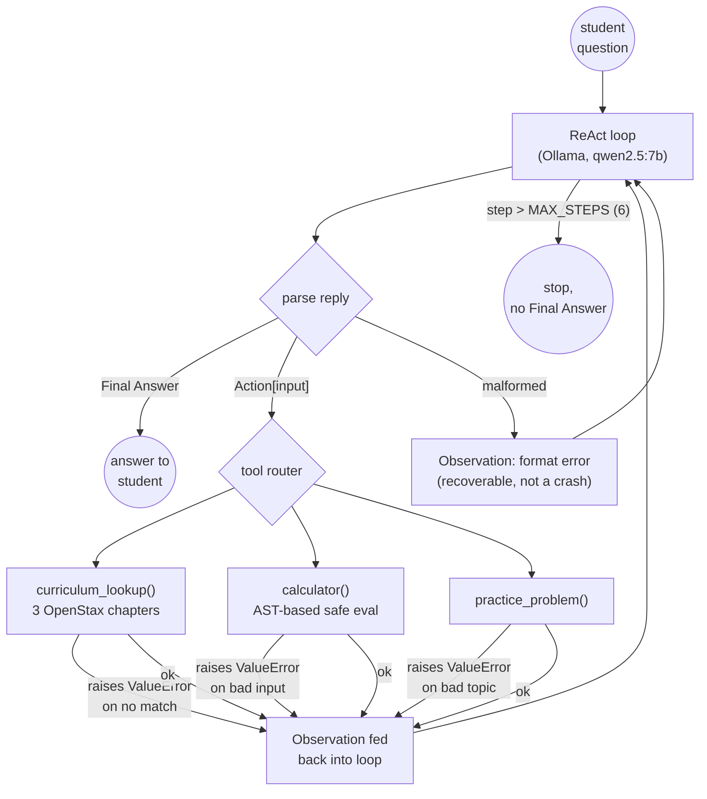

# Task 1 — A tool-using homework-help agent from scratch

A hand-rolled ReAct loop, no LangChain/LangGraph/agent framework of any
kind, over three tools: curriculum lookup (OpenStax Prealgebra 2e),
calculator, and practice-problem generator, with a hard step limit.

## Architecture



## What this measures

Whether a hand-rolled agent loop, with no framework doing tool-call
parsing or looping for you, can (1) pick the right tool for a question,
(2) survive a tool raising an exception without crashing or hallucinating
past it, and (3) never run unbounded even when the model refuses to stop.

## Curriculum source

`curriculum/*.json`, three sections adapted from **OpenStax Prealgebra
2e** (openstax.org, CC BY 4.0): Solving Linear Equations, Fractions, and
Ratios and Proportions. Adapted/summarized rather than copied verbatim,
each section carries its chapter and source citation, and
`curriculum_lookup()` returns that citation with every result.

## A real, observed model-choice finding

The roadmap warns that smaller open models are noticeably weaker at
structured tool-calling than Groq/Gemini's hosted defaults. That showed
up immediately with `qwen2.5:7b`: the first live run emitted
`curriculum_lookup("Solving Linear Equations")` (parentheses) instead of
the prompted `curriculum_lookup[...]` (brackets), and wrote out multiple
Thought/Action steps in a single turn instead of stopping after one. Two
fixes, both in `agent.py`:

1. `ACTION_RE` now accepts both `tool[arg]` and `tool(arg)` syntax rather
   than failing closed on the model's actual (if non-compliant) output.
2. `FINAL_RE` takes only the first `Final Answer:` block up to the next
   `Thought:`, so a reply that keeps going after answering doesn't corrupt
   the parsed answer.
3. The system prompt gained an explicit one-shot example and an explicit
   "one Thought/Action pair per turn" instruction, which reduced (but did
   not eliminate) the multi-step-per-turn behavior.

This was treated as the real engineering problem the roadmap describes,
not routed around by switching to Gemini, `qwen2.5:7b` remains the
default model and is what every "done when" run below actually used.

## Done when (real, live runs against qwen2.5:7b)

**Picks the right tool and answers correctly:**
```
Question: How do I solve 3x + 2 = 11? Then give me a practice problem on the same topic.

step 1: curriculum_lookup["how to solve a linear equation"]
  -> [Solving Linear Equations > The Subtraction and Addition Properties of
     Equality] ... (source: Adapted from OpenStax Prealgebra 2e, Chapter 2 ...)
step 2-5: calculator["3*x + 2 = 11"], calculator["3*x + 2"], calculator["3*x + 2 - 2"], calculator["3*x"]
  -> Error: Unsupported expression element: Name(id='x', ctx=Load())  (x4)
step 6: Final Answer: First, subtract 2 from both sides of the equation
  3x + 2 = 11. This gives you 3x = 9. Next, divide both sides by 3 to
  isolate x, which results in x = 3.

Hit step limit: False
```

**Recovers from a tool error** (the same run above, and independently in
a second live run):
```
step 1: practice_problem["line_equations, easy"]
  -> Error: Unknown topic 'line_equations', expected one of ['fractions', 'linear_equations', 'ratios']
step 2: practice_problem["linear_equations, easy"]
  -> Solve for x: 6x + 4 = 10  (answer: x = 1)
```
The model self-corrected from a hallucinated topic name to a valid one
after seeing the tool's real error message, no crash, no silent wrong
answer.

**Can't loop forever**, run live with a prompt explicitly telling the
model to "never stop" and `max_steps=3`:
```
step 1: practice_problem["line_equations, easy"] -> Error: Unknown topic ...
step 2: practice_problem["linear_equations, easy"] -> Solve for x: 6x + 4 = 10 (answer: x = 1)
step 3: practice_problem["fractions, easy"] -> Add the fractions: 4/4 + 7/8 (simplify your answer)
Final: None
Hit step limit: True
```
The loop hard-stops at `max_steps` with no `Final Answer`, rather than
continuing to call Ollama indefinitely.

## Tests

19 offline pytest tests (`tests/test_tools.py`, `tests/test_agent.py`),
all tool functions plus the agent loop driven by a scripted `chat_fn` (no
live Ollama call in CI), covering: correct tool selection, curriculum
no-match / empty-query errors, calculator syntax/AST-safety/division-by-
zero errors, practice-problem bad-topic/bad-difficulty errors, format-
error recovery, unknown-tool-name recovery, and the step-limit cap.

```bash
cd tutorloop/task-1
../.venv/bin/pytest tests -v     # 19 passed
../.venv/bin/python agent.py "your question here"   # live run against Ollama
```

## Why AST-based, not `eval()`, for the calculator

`calculator()` parses with `ast.parse` and walks a small whitelist of
node types (`Constant`, `BinOp`, `UnaryOp` over `+ - * / ** %`), rather
than calling `eval()`. `test_calculator_rejects_non_arithmetic` feeds it
`__import__('os').system('echo hi')` and confirms it raises `ValueError`
instead of executing anything, since the agent loop passes whatever
string the LLM decides to put inside `calculator[...]` straight to this
function.
