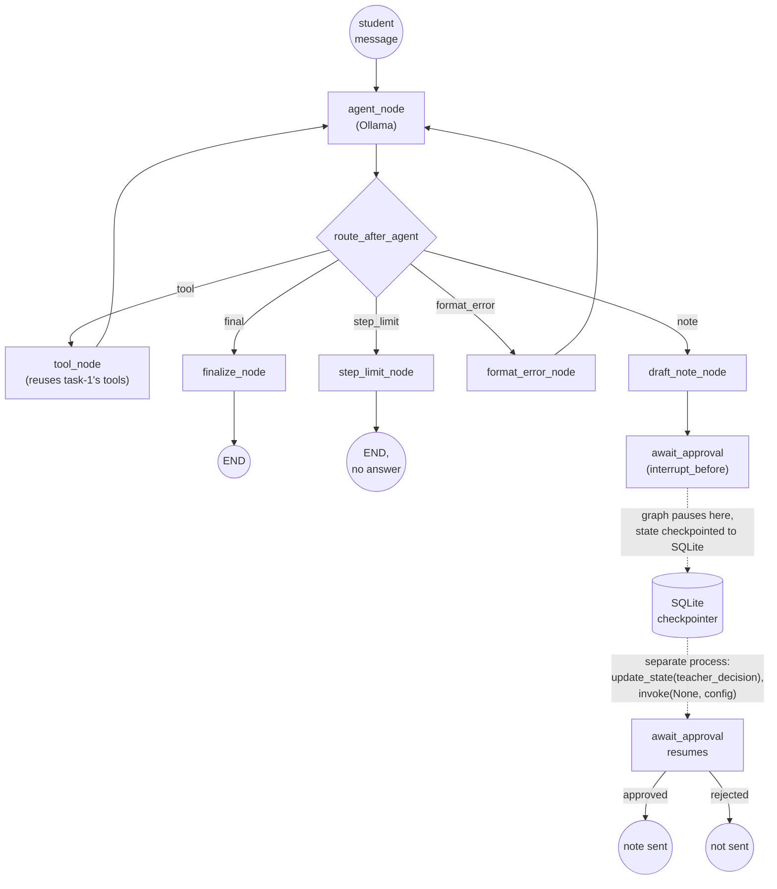

# Task 2 — Agent frameworks and durable state, with a teacher in the loop

Task 1's hand-rolled ReAct agent rebuilt as a **LangGraph** state machine,
with conditional routing, a SQLite checkpointer for durable state, and a
human-in-the-loop pause before anything that would reach a parent or
affect a grade.

## Architecture



## What this measures

Whether durable state actually works: not "does the agent pause," any
`if` statement can do that, but does it pause, get checkpointed to disk,
and correctly resume **in a separate process invocation** with no
in-memory state carried over, which is the real shape of "teacher
approves later, maybe tomorrow, maybe from a different machine."

## New capability vs. Task 1: `DraftNote`

The agent can now draft a progress note when a student explicitly asks
it to tell their teacher something. Drafting one routes to
`await_approval`, and the graph is compiled with
`interrupt_before=["await_approval"]`, so LangGraph itself pauses
execution before that node runs, before any "send" logic executes. This
is the actual guardrail: the send logic simply cannot run until an
external caller updates state with a `teacher_decision` and re-invokes.

## Done when (real, live runs)

**Pauses correctly** (`demo.py start`, live Ollama, process 1):
```
$ python demo.py start "Please let my teacher know I'm really struggling
  with solving linear equations and could use extra help"
thread_id: 438b3da9
progress_note: I'm having some trouble understanding how to solve linear
  equations. Could we schedule some extra help sessions?
final_answer: None
next node (paused here if non-empty): ('await_approval',)
```

**Resumes from saved state after approval**, run as a **separate process
invocation** minutes later, with no shared Python process or in-memory
state, only `tutorloop_state.sqlite` on disk connects the two runs:
```
$ python demo.py resume 438b3da9 approved
state loaded from disk, was paused at: ('await_approval',)
final_answer: Progress note sent to teacher: I'm having some trouble
  understanding how to solve linear equations. Could we schedule some
  extra help sessions?
sent: True
```

**A normal question never pauses** (no note requested, live Ollama):
```
$ python demo.py start "What is 12 * 8, and can you give me a fractions
  practice problem?"
progress_note: None
final_answer: Great job calculating that 12 * 8 equals 96! Here's an easy
  fractions practice problem for you: What is 1/4 of 20?
next node (paused here if non-empty): ()
```

## Tests

7 offline pytest tests (`tests/test_graph.py`) using LangGraph's
`MemorySaver` and a scripted `chat_fn`, no live Ollama call needed in CI:
normal question completes without pausing, a note request pauses exactly
before `await_approval`, resuming after `approved` sends and after
`rejected` doesn't, tool-error recovery, malformed-response recovery, and
the step limit still stops the graph (`state["step"] == MAX_STEPS + 1`,
`next == ()`).

```bash
cd tutorloop/task-2
../.venv/bin/pytest tests -v          # 7 passed
../.venv/bin/python demo.py start "..."
../.venv/bin/python demo.py resume <thread_id> approved
```

## Why LangGraph's own checkpointer, not a hand-rolled one

Task 1 proved the ReAct loop itself works without a framework. Task 2's
point is durable state and pausing, which is exactly the piece a
framework earns its keep on: `interrupt_before` plus a `Saver` gets
correct pause/resume/replay semantics (including replaying the same
checkpoint twice being safe) for free, that a hand-rolled version would
have to reimplement and re-verify.
