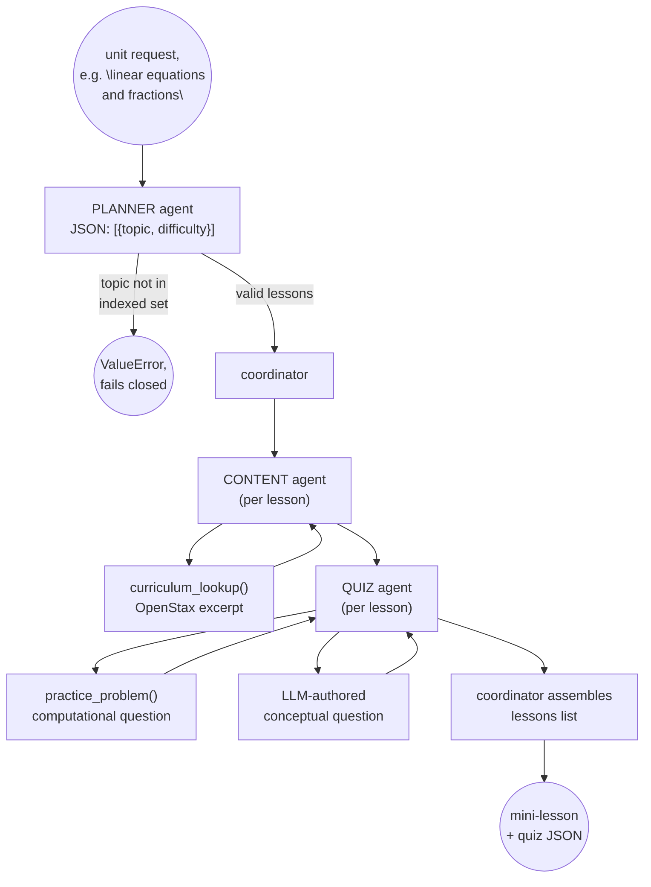

# Task 3 — Multi-agent orchestration

A planner agent breaks a unit into lessons, a content agent drafts an
explanation grounded in the OpenStax material, a quiz agent writes an
aligned quiz, and a coordinator ties all three together into one
mini-lesson-plus-quiz result.

## Architecture



## What this measures

Whether splitting the work across agents with distinct, narrow
responsibilities produces something more grounded and more checkable than
one agent doing everything: the planner can only choose from indexed
topics (fails closed on anything else, tested), the content agent can
only ground in what `curriculum_lookup()` actually returns, and the quiz
agent's computational question comes from the same deterministic
`practice_problem()` tool Task 1 built, not the LLM inventing arithmetic.

## Done when (real, live run against qwen2.5:7b)

`python demo.py "A unit reviewing linear equations and fractions for a
7th grader"` produced a 2-lesson unit end to end:

```json
{
  "unit": "A unit reviewing linear equations and fractions for a 7th grader",
  "lessons": [
    {
      "content": {
        "topic": "fractions",
        "explanation": "A fraction shows how many parts of a whole you have...",
        "grounding": "[Fractions > Visualize Fractions] ... (source: Adapted from OpenStax Prealgebra 2e, Chapter 4 ...)"
      },
      "quiz": {
        "computational_question": "Add the fractions: 4/5 + 1/7  (simplify your answer)",
        "conceptual_question": "Which of these fractions is not in its simplest form: 4/8, 3/5, or 7/9?"
      }
    },
    {
      "content": {
        "topic": "linear_equations",
        "explanation": "A linear equation is a math sentence where two expressions are equal...",
        "grounding": "[Solving Linear Equations > The Subtraction and Addition Properties of Equality] ..."
      },
      "quiz": {
        "computational_question": "Solve for x: 2x + 10 = 20  (answer: x = 5)",
        "conceptual_question": "If you have the equation x - 8 = 12, which operation would you perform to solve for x..."
      }
    }
  ]
}
```

Full raw output is reproducible via `python demo.py "<unit>"`. Coherent
here means: the planner picked exactly the two topics the unit named, no
more, no fewer; every explanation traces to a specific `grounding` field
with a real chapter/section citation; every computational question came
from `practice_problem()`, not the LLM; every conceptual question
references content from that lesson's own explanation, not a generic
question.

## Tests

8 offline pytest tests (`tests/test_agents.py`), scripted `chat_fn` per
agent, no live Ollama call needed in CI: valid-topic planning, planner
fails closed on an unindexed topic (`history`), missing-difficulty
defaulting, prose-wrapped-JSON parsing (models don't always emit bare
JSON), content grounding is traceable to the real curriculum excerpt,
quiz combines a deterministic computational question with an LLM
conceptual one, a full 2-lesson coordinator run, and the coordinator
correctly propagating a planner error instead of silently producing a
broken lesson.

```bash
cd tutorloop/task-3
../.venv/bin/pytest tests -v           # 8 passed
../.venv/bin/python demo.py "your unit description here"
```

## When would a single agent have sufficed?

Honestly: for the exact scope this task builds (3 indexed topics, one
computational-plus-conceptual question per lesson), a single agent making
one tool-augmented pass per topic would likely produce comparable output.
The task doesn't require anything a single well-prompted ReAct loop
(Task 1's) couldn't do by looping over topics itself.

Where the split actually earns its complexity is in what it makes
independently testable and independently improvable:

- **The planner's output is a hard boundary.** `content_agent` and
  `quiz_agent` never see the raw unit description, only a topic string
  already validated against the indexed set. A single agent conflates
  "decide what to teach" with "teach it," so a bad planning decision
  (an off-curriculum topic) surfaces downstream as a bad explanation
  instead of failing immediately and closed, which is exactly what
  `test_planner_agent_rejects_unindexed_topic` exercises.
- **The quiz agent's computational question never touches the LLM.** In
  a single-agent design it's much easier for "generate a quiz" to
  quietly become "ask the LLM to write a math problem and its answer,"
  which is the same freelanced-arithmetic risk Task 1's calculator tool
  exists to prevent. Keeping quiz generation a separate agent with its
  own tool call makes that boundary an architectural fact, not a prompt
  instruction that can drift.
- **Each agent's prompt stays small and single-purpose,** which matters
  more as a system grows past 3 topics: a single mega-prompt asking one
  model to plan, explain, and quiz in one pass is exactly the shape that
  degrades first when scaled to a real curriculum with dozens of topics,
  since a single system prompt would need to hold rules for all three
  jobs simultaneously.

The honest conclusion: multi-agent here is a defensible architectural
choice for testability and failure isolation, not a capability a single
agent couldn't reach. At this scale it is closer to "good separation of
concerns" than "necessary orchestration," the latter becomes true once
the number of topics, agent-specific tools, or independent
failure/retry policies grows enough that a single prompt genuinely can't
hold the whole job.
