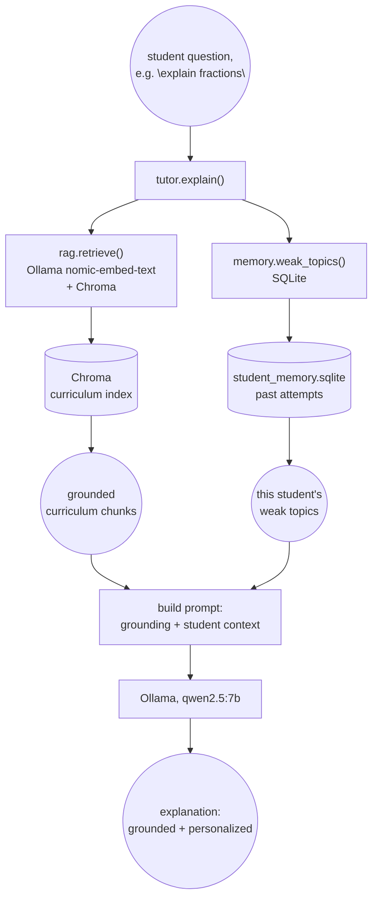

# Task 4 — Memory and a RAG-powered tutor

Long-term memory of a student's past performance (SQLite) combined with
real indexed retrieval over the OpenStax excerpts (Chroma + Ollama
`nomic-embed-text` embeddings), replacing Task 1's keyword search with
dense retrieval and personalizing every explanation to what the student
has actually struggled with before.

## Architecture



## What this measures

Whether the tutor's explanation is genuinely two things at once: grounded
(traceable to a real retrieved chunk, not freelanced) and personalized
(references the specific past struggle a *specific* student had, not a
generic "you might find this tricky" line). Both are checked
independently: `grounded_in` always carries the retrieved chunks
regardless of memory, `recalled_weak_topic` is only non-null when that
student's own history actually shows below-threshold accuracy on a
matching topic.

## Done when (real, live run against qwen2.5:7b + a real Chroma index)

Seeded `alex`'s memory with two wrong fractions attempts and one correct
one (33% accuracy), then asked the tutor to explain fractions:

```
$ python demo.py
Seeded memory: alex got fractions wrong twice, right once (33% accuracy)

recalled_weak_topic: {'topic': 'fractions', 'accuracy': 0.3333333333333333, 'attempts': 3}
grounded_in: [{'chapter': 'Fractions', 'title': 'Visualize Fractions'}, {'chapter': 'Fractions', 'title': 'Multiply and Divide Fractions'}]

explanation:
Certainly! Let's start with the basics of fractions to make sure you feel confident.

### Understanding Fractions

A fraction is a way to represent parts of a whole. It consists of two numbers:
- Numerator (Top Number): This tells us how many parts we are considering.
- Denominator (Bottom Number): This indicates into how many equal parts the whole is divided.

For example, in the fraction 3/4:
- The numerator 3 means you have 3 parts.
- The denominator 4 means these parts come from dividing a whole into 4 equal parts.

### Simplifying Fractions
...
Would you like to practice these steps with some examples?

--- second student, no fractions history ---
recalled_weak_topic: None
```

`recalled_weak_topic` was non-null and correctly identified for `alex`
(the explanation opens by grounding in the basics rather than assuming
prior mastery, consistent with the "struggled before" system prompt
instruction) and `None` for `sam`, a second student with no fractions
history, confirming recall isn't just always-on boilerplate. See
`tests/test_tutor.py::test_explain_no_recall_for_a_strong_topic` and
`::test_explain_recall_is_per_student` for the offline version of this
same check.

Retrieval sanity check, confirming the embeddings are actually semantic
and not just keyword overlap (`"how do I add fractions with different
denominators"` shares almost no tokens with the winning section title):

```
$ python -c "from rag import retrieve; [print(r['chapter'], '>', r['title'], 'distance=', round(r['distance'],4)) for r in retrieve('how do I add fractions with different denominators', k=2)]"
Fractions > Add and Subtract Fractions with Common Denominators distance= 165.1606
Fractions > Multiply and Divide Fractions distance= 245.5337
```

## Tests

14 offline pytest tests, no live Ollama call and no built Chroma index
needed in CI:
- `tests/test_memory.py` (7): weak-topic accuracy math, per-student
  isolation, weakest-first sorting, history filtering.
- `tests/test_rag_loading.py` (3): the pure chunk-loading logic
  (`load_sections()`), no embedding calls needed, just confirms all 3
  chapters load with the required fields and unique ids.
- `tests/test_tutor.py` (4): `chat_fn` and `retrieve_fn` are both
  injectable, so these test the actual logic, does a matched weak topic
  reach the LLM prompt text, not just get computed and discarded, without
  needing an embedding model or a live chat model.

```bash
cd tutorloop/task-4
../.venv/bin/pytest tests -v              # 14 passed
../.venv/bin/python rag.py                # builds the real Chroma index
../.venv/bin/python demo.py               # live run against Ollama
```

## Why Chroma + Ollama embeddings, not the keyword search from Task 1

Task 1's `curriculum_lookup()` is fine for 3 chapters and a hand-rolled
demo, but it's token-overlap search, it has no notion of semantic
similarity. `rag.py` replaces it with dense retrieval: a persistent Chroma
collection embedded with a real embedding model, the same free, local,
no-API-key pattern RxGround's task-1 uses (there with
`BAAI/bge-base-en-v1.5` via sentence-transformers).

**Embedding model, and a real mid-build swap**: this task was originally
built against sentence-transformers' `all-MiniLM-L6-v2`, downloaded from
the HF Hub. That download turned out to be severely bandwidth-throttled in
this environment: observed transfer speed degraded from ~150KB/s to under
10KB/s over 15+ minutes (confirmed via HF's own xet transfer logs and,
separately, a raw `curl` against the CDN URL, which measured the same
~10-30KB/s and ruled out anything client-side), against ~1.8MB/s to other
hosts in the same session, so this wasn't a general connectivity problem,
specifically the HF CDN. At that rate a one-time ~87MB weights fetch would
have taken over an hour with retries still failing outright on SSL
handshake timeouts.

Switched to Ollama's local `nomic-embed-text` model instead (`POST
/api/embeddings`, via the `ollama` Python client) rather than keep
fighting a throttled CDN. It was already pulled locally from earlier
roadmap work, needs no network fetch to use here, and is arguably a better
fit for this repo anyway: every other task (1-3) is already Ollama-first,
so this removes the one HF Hub dependency task 4 otherwise would have
introduced. The tradeoff is one embedding call per section/query instead
of a single batched `model.encode()` call, acceptable at this task's
scale (a handful of curriculum sections, one query per tutor call).
