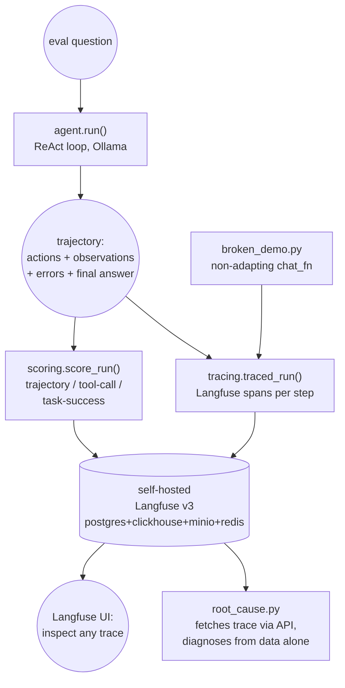

# Task 5 — Tracing via self-hosted Langfuse + trajectory/tool-call/task-success eval

Full tracing of a ReAct tutoring agent's runs through a self-hosted
Langfuse instance, an evaluation layer that scores each run on three
independent signals (did it use the right tool, did the tool calls
succeed, did it reach the right final answer), and a deliberately-broken
session used to demonstrate root-causing a failure from its trace alone.

## Architecture



`agent.py` and `scoring.py` are both fully independent of Langfuse (no
import of it at all), so the ReAct loop and the three scoring functions
are unit-tested offline with a scripted `chat_fn`/scripted trajectories.
`tracing.py` is the only module that talks to the Langfuse server, wiring
the two together and pushing each run's three scores back onto its trace.

## Why a self-contained agent here instead of importing Task 1's

Each task branches off `main`, which has no earlier task merged into it
yet (hard PR-workflow rule: branch, PR, never merge until reviewed), so a
later task's branch can't `import` an earlier task's still-unmerged code.
Every task folder in this repo is therefore self-contained, `task-5/`
re-derives the same three-tool ReAct shape Task 1 has rather than
depending on it. The point of Task 5 isn't the agent loop itself (that's
Task 1/2's job), it's the tracing and eval layer wrapped around it.

## Setup

```bash
cd task-5
cp .env.example .env   # already done in this repo, .env is gitignored
docker compose up -d
# wait for langfuse-web healthy (curl localhost:3000/api/public/health), then:
../.venv/bin/python eval.py
../.venv/bin/python broken_demo.py
../.venv/bin/python root_cause.py
```

## Two real infra swaps mid-task

**1. v3 -> v2 -> back to v3.** Originally targeted Langfuse's v3 self-host
stack (postgres + clickhouse + minio + redis + separate worker). Pulling
`langfuse/langfuse:3`, `langfuse/langfuse-worker:3`, and
`clickhouse/clickhouse-server` from docker.io hit repeated TLS handshake
timeouts and truncated reads against `production.cloudfront.docker.com`
over ~20 minutes of real attempts (multiple distinct failure signatures:
`net/http: TLS handshake timeout`, `unexpected EOF` at varying byte
offsets). Fell back to Langfuse's v2 line (single postgres-backed image)
to minimize pull weight, pulling it via `ghcr.io` as a mirror (worked
cleanly where `docker.io` didn't). v2 came up healthy in under a minute,
but the currently-installed Langfuse Python SDK (v4, OTel-native) sends
traces via OTLP, an ingestion path v2's server doesn't expose, real spans
came back `Failed to export span batch code: 404`. Retried the v3 pulls
from `docker.io` directly and this time all five images (clickhouse,
minio, minio/mc, redis, langfuse-worker) pulled cleanly in under two
minutes, the earlier CDN throttling was transient, not permanent, so
went back to v3 (pulling only the two Langfuse-authored images from
`ghcr.io`, since that mirror had already proven reliable).

**2. Two real config gaps in the v3 compose stack.** Bringing the v3
stack up the first time, `langfuse-web` crash-looped:
- `Error: CLICKHOUSE_MIGRATION_URL is not configured` — Langfuse's
  clickhouse migrations connect over the native protocol port (9000), a
  separate env var from `CLICKHOUSE_URL` (the HTTP port, 8123, used for
  queries).
- After fixing that: `There is no Zookeeper configuration ... ON CLUSTER
  default` — the bundled migration SQL defaults to a replicated-cluster
  DDL statement, which needs `CLICKHOUSE_CLUSTER_ENABLED=false` to run
  against a single-node clickhouse instance instead.

Both are captured as comments directly in `docker-compose.yml` next to
the env vars that fix them. Final state, confirmed live: all 6 containers
healthy, `http://localhost:3000/api/public/health` returns 200.

## Done when (real, live run against qwen2.5:7b + the live Langfuse stack)

```
$ python eval.py
question                                                traj   tool%  task   term   trace
What is 17 + 25?                                        True   1.00   True   True   http://localhost:3000/project/tutorloop-task5/traces/dd31fcd963cc9e9896e5ce3cfcaa8b9c
Explain how to add fractions with different denominat   False  1.00   False  True   http://localhost:3000/project/tutorloop-task5/traces/b2c82926bd37d1200579031daf1d92b3
Give me a medium difficulty practice problem about ra   True   1.00   True   True   http://localhost:3000/project/tutorloop-task5/traces/2b821d800510dc9aedd7fe97a7ec93c7

trajectory-correct: 67%  task-success: 67%  n=3
```

This is a **real, not cherry-picked** result: 2 of 3 genuinely succeeded,
1 genuinely failed. Inspecting the failing trace (`b2c82926...`) via the
API shows why: asked to "explain how to add fractions with different
denominators," the agent called `practice_problem` (which generates a
problem to solve) instead of `curriculum_lookup` (which retrieves an
explanation), then called `calculator` to solve the practice problem it
generated, returning `39/56`, a computed fraction, not an explanation.
`trajectory_used_expected_tool` and `task_success` both correctly caught
this as a failure; `tool_call_success_rate` is still `1.0` because every
tool call it *did* make succeeded, exactly the kind of case these three
signals being independent is meant to surface: the agent didn't
malfunction, it solved a different (self-generated) problem than the one
asked.

```
$ python broken_demo.py
Good trace:   http://localhost:3000/project/tutorloop-task5/traces/9c35a6e162ce3d85dcb802a6ee769308
Good scores:  {'trajectory_used_expected_tool': True, 'tool_call_success_rate': 1.0, 'task_success': True, 'terminated': True, 'steps_used': 3}

Broken trace: http://localhost:3000/project/tutorloop-task5/traces/6a401edf33b791fc3e38eace6b86b568
Broken scores: {'trajectory_used_expected_tool': True, 'tool_call_success_rate': 0.0, 'task_success': False, 'terminated': False, 'steps_used': 12}

$ python root_cause.py
Trace 6a401edf33b791fc3e38eace6b86b568
  name=tutorloop-task5-BROKEN-agent-run
  scores={'trajectory_used_expected_tool': 1.0, 'steps_used': 12.0, 'terminated': 0.0, 'tool_call_success_rate': 0.0, 'task_success': 0.0}

Observed 13 spans, 6 tool calls, 6 errored.

First error at 'step-0-error': Could not parse '15% of 40' as an expression: invalid syntax (<unknown>, line 1)
Action that caused it: {'tool': 'calculator', 'arg': '15% of 40'}

ROOT CAUSE: the identical action input appears 6 times across the trajectory, the agent never varied its Action after seeing the error Observation, meaning it isn't reading tool feedback back into its next decision. This is a prompt/loop bug, not a tool bug, the tool (calculator) is correctly rejecting '15% of 40' since it isn't a pure arithmetic expression the AST evaluator accepts.

Final answer reached: None (None means it hit the step limit still stuck)
```

`root_cause.py` reaches this diagnosis using only `client.api.trace.get()`
against the live server, no access to the trajectory that produced it,
which is the actual point: everything needed to root-cause a failed
session is recoverable from its trace alone.

Two real bugs surfaced and fixed while running this live (not
hypothetical, both changed the shipped code):
- **Score-read race**: a trace fetched immediately after
  `traced_run()`'s `client.flush()` can briefly show `scores=[]`, score
  ingestion goes through Langfuse's async worker queue. `root_cause.py`
  polls a few times before giving up.
- **Observation-matching bug**: error spans carry `{"tool", "message"}`,
  action spans carry `{"tool", "arg"}`, comparing an error span's `input`
  directly against action spans' `input` never matches (different
  shapes). Fixed by matching on the trajectory step index instead (each
  `step-N-action`/`step-N-error` pair shares `N`).

## Tests

17 offline pytest tests, no live Ollama call and no Langfuse server
needed in CI:
- `tests/test_agent.py` (5): the ReAct loop itself, tool-call recording,
  tool-error recording (and that it doesn't crash the loop), the step
  limit actually stopping an agent that never emits a Final Answer, and
  recovery from an unparseable reply.
- `tests/test_scoring.py` (12): each of the three scoring signals in
  isolation, plus a test that deliberately makes trajectory-correctness
  and task-success disagree (right tool, tool succeeded, wrong final
  answer), since scoring them as independent signals is the whole point.

```bash
cd tutorloop/task-5
../.venv/bin/pytest tests -v              # 17 passed
../.venv/bin/python eval.py               # live eval against Ollama + Langfuse
../.venv/bin/python broken_demo.py        # traces a good run and a broken one
../.venv/bin/python root_cause.py         # root-causes the broken trace via the API
```
