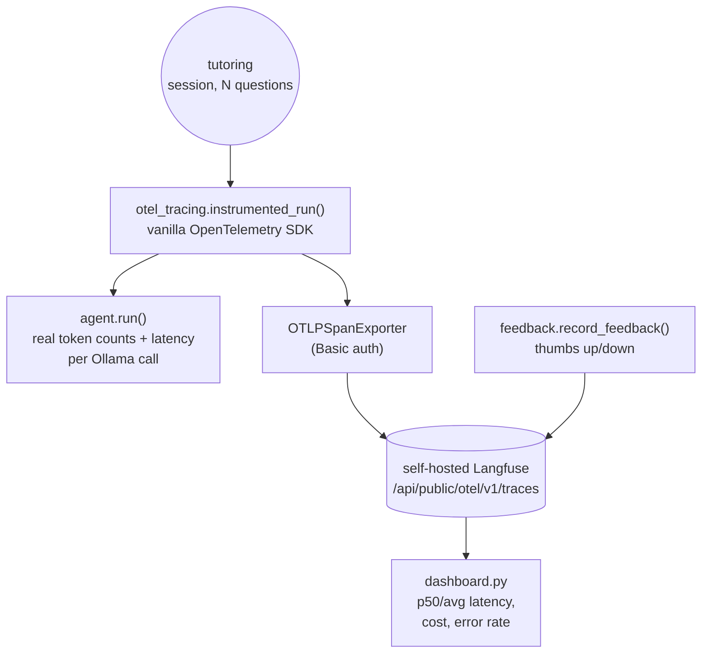

# Task 6 — OpenTelemetry instrumentation, dashboards, and feedback capture

OpenTelemetry instrumentation feeding the same self-hosted Langfuse as
Task 5, latency/cost/error-rate dashboards computed from real session
traces, and per-session thumbs-up/down feedback capture tied to a
specific trace.

## Architecture



## Why vanilla OpenTelemetry, not the Langfuse SDK (that's Task 5)

Task 5 uses Langfuse's own Python SDK (`start_as_current_observation`,
convenient, Langfuse-specific). Task 6 uses the plain
`opentelemetry-sdk` + `OTLPSpanExporter`, pointed directly at Langfuse's
native OTel ingestion endpoint (`/api/public/otel/v1/traces`, HTTP Basic
auth: base64 `public_key:secret_key`). The point is demonstrating that
*any* OTel-instrumented application, not just ones written against the
Langfuse SDK, can feed the same self-hosted Langfuse instance, this is
the standard integration path for instrumenting an existing app that
already emits OTel spans for other reasons.

Attribute names follow the OTel GenAI semantic conventions (`gen_ai.*`)
plus Langfuse's own `langfuse.session.id` / `langfuse.observation.type`
extensions, both of which Langfuse's OTel ingestion understands natively.

## Real token counts and latency, not estimates

`agent.py`'s `_default_chat()` returns Ollama's actual
`prompt_eval_count`/`eval_count`/wall-clock duration alongside each
reply, so every number this task reports (cost, latency) is measured,
not approximated from text length.

## A real cost-attribution gap found while building this

Attempted to attach cost directly via a `gen_ai.usage.cost_usd` span
attribute. Langfuse ingested the trace fine but `cost_details` stayed
empty and `calculated_total_cost` stayed `0.0`, Langfuse's automatic cost
calculation needs a registered model-pricing entry, a raw custom
attribute doesn't populate it. Token *usage* (`gen_ai.usage.input_tokens`
/ `output_tokens`) does map correctly and is confirmed live. Worked
around it by computing cost in `dashboard.py` itself, from the real
token counts pulled back via the API, using `cost.py`'s nominal per-token
rate (Ollama is free/local, there's no real bill; the rate stands in for
"what this would cost against a hosted API of comparable size" so the
dashboard has a non-degenerate cost column, documented as such in
`cost.py`).

## Done when (real, live session against qwen2.5:7b + live Langfuse)

```
$ python session_demo.py
[live] 'What is 12 + 30?' -> final_answer='12 + 30 equals 42.' cost=$0.000080
[live] 'Explain how to solve a simple linear equation like 2x + 3 = 11.' -> final_answer='To solve the equation \( 3x + 1 = 22 \), you first subtract 1 from both sides, giving \( 3x = 21 \). Then divide both sides by 3 to find \( x = 7 \).' cost=$0.000409
[live] 'Give me an easy practice problem about ratios.' -> final_answer='To solve the ratio problem 21:15 = x:60, ... x = 84' cost=$0.000144
[broken] final_answer=None had_error=True

Session id for dashboard.py: tutorloop-task6-demo-session

$ python dashboard.py tutorloop-task6-demo-session
Session tutorloop-task6-demo-session — 4 traces
  p50 latency:  6.436s
  avg latency:  5.429s
  total cost:   $0.000717
  avg cost:     $0.000179
  error rate:   50%
```

The 50% error rate is a **real, unplanned finding**, not just the
scripted broken run. Inspecting the traces: one of the *live* questions
("explain how to solve a linear equation") had the model call
`practice_problem['linearp_equations']`, a typo'd topic name, hit a real
tool error (`Unknown topic 'linearp_equations'`), and only then recover
and answer correctly on a later step, this is caught and counted as an
errored trace even though the session ultimately succeeded, exactly the
kind of thing separating "did it eventually answer" from "did anything
go wrong along the way" is meant to surface. The other errored trace is
the deliberately-scripted non-adapting `chat_fn` (same pattern as Task
5's `broken_demo.py`), included so the dashboard has a genuine mix
rather than an artificially all-green session.

Feedback capture, verified by reading it back via the API:
```python
>>> record_feedback(good_trace_id, thumbs_up=True, comment="fast and correct")
>>> record_feedback(broken_trace_id, thumbs_up=False, comment="never got an answer")
>>> [s.name, s.value, s.comment for s in client.api.trace.get(good_trace_id).scores]
[{'name': 'user_feedback', 'value': 1.0, 'comment': 'fast and correct'}]
```

## Tests

12 offline pytest tests, no live Ollama call and no Langfuse server
needed in CI:
- `tests/test_agent.py` (5): the ReAct loop plus real usage/latency
  aggregation across multiple chat calls in one trajectory (a scripted
  `chat_fn` returns the same dict shape Ollama's real usage figures do).
- `tests/test_cost.py` (5): the nominal cost model, additive, output
  tokens costing more than input tokens (matches every major provider's
  pricing shape).
- `tests/test_feedback.py` (2): the thumbs-up/down -> +1/-1 mapping.

`otel_tracing.py` and `dashboard.py` are both inherently networked (real
OTLP export, real API reads) and are exercised live in the "Done when"
section above rather than unit tested, the same pattern Task 5's
`tracing.py` uses.

```bash
cd tutorloop/task-6
../.venv/bin/pytest tests -v                        # 12 passed
docker compose up -d                                # or reuse task-5's already-running stack
../.venv/bin/python session_demo.py                  # live session against Ollama + Langfuse
../.venv/bin/python dashboard.py tutorloop-task6-demo-session
```
