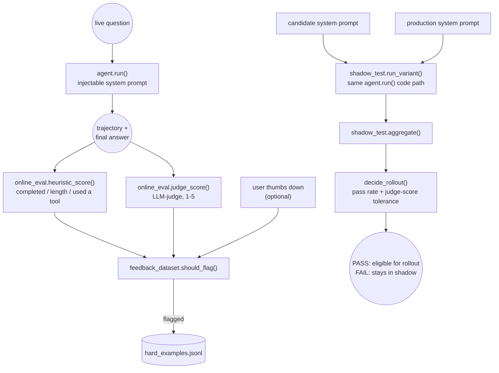

# Task 7 — Online eval, feedback-to-dataset loop, and shadow-tested rollout

Scoring live tutoring sessions with no ground-truth expected answer
available at serve time, feeding sessions that fail eval into a dataset
of hard examples instead of discarding them, and shadow-testing a
candidate prompt against the current one before it ever reaches a real
session.

## Architecture



## Why online eval needs different signals than Task 5's offline eval

Task 5 scores against a *known* expected tool and expected answer
substring, real production traffic has neither. `online_eval.py` splits
into two layers instead: cheap, always-on heuristics (`completed_without_
error`, `answer_length_reasonable`, `used_a_tool`, no model call, every
single session) and an occasional LLM-judge call rating quality 1-5 (a
real Ollama call, the one thing a heuristic can't approximate, used
sparingly the way a real system would sample-judge rather than judge
every request).

## Done when (real, live runs against qwen2.5:7b)

**Shadow test**: candidate prompt appends "Keep your Final Answer to two
sentences or fewer" to the production system prompt.

```
$ python shadow_test.py
Baseline:  {'n': 3, 'heuristic_pass_rate': 1.0, 'avg_judge_score': 3.67}
Candidate: {'n': 3, 'heuristic_pass_rate': 0.33, 'avg_judge_score': 4.33}

Rollout decision: FAIL — heuristic pass rate regressed: 33% < baseline 100%
```

**A real, unplanned failure**, not engineered to demonstrate the gate
working: the candidate's higher average judge score (4.33 vs 3.67, the
brevity instruction genuinely produced answers the judge rated higher)
would have looked like a win on a single metric. `decide_rollout()`
correctly blocked it anyway, because two *different* questions failed the
heuristic layer for two *different* real reasons:
- **"Explain what a fraction is"**: the brevity instruction made the
  model skip `curriculum_lookup` entirely and answer from parametric
  knowledge (`used_a_tool: False`), a fluent answer that isn't actually
  grounded in the curriculum this system is supposed to teach from.
- **"Give me an easy practice problem about linear equations"**: the
  model called `practice_problem['lineary_equations']` (a typo), hit a
  real tool error, then recovered and answered correctly on the next
  step, exactly the kind of trajectory Task 5/6 also caught: it
  eventually succeeded, but something genuinely went wrong along the way,
  and `completed_without_error` correctly flags that.

This is precisely why `decide_rollout()` requires the heuristic pass rate
not to regress *at all*, rather than only checking the judge score: a
prompt change can make answers read better while quietly breaking
grounding or reliability, and a single blended score would have missed
both real regressions here.

**Feedback-to-dataset loop**, run against the same candidate's 3 results:

```
$ python -c "..."
What is 8 + 15? -> flagged: False
Explain what a fraction is. -> flagged: False
Give me an easy practice problem about l -> flagged: True

Dataset now has 1 entries:
 - Give me an easy practice problem about linear equations. ['heuristic_fail']
```

Only the session that actually failed heuristic eval got written to
`hard_examples.jsonl`, the other two (including the fraction-explanation
one that skipped its tool call, a real quality problem but not one that
tripped a heuristic) did not, showing the dataset is genuinely filtered,
not just every session logged.

## Tests

37 offline pytest tests, no live Ollama call needed in CI:
- `tests/test_agent.py` (5): the ReAct loop, plus that the injectable
  `system` argument is actually used (this is what makes shadow-testing a
  candidate prompt through the real code path possible).
- `tests/test_online_eval.py` (20): each heuristic check in isolation,
  the composite `heuristic_score`/`heuristic_pass`, and the judge-score
  digit-parsing logic (embedded digit, unparseable reply) with a scripted
  `chat_fn`.
- `tests/test_feedback_dataset.py` (11): flagging logic for each
  independent reason (heuristic fail, low judge score, thumbs down) and
  combinations, real file writes/reads via `tmp_path`.
- `tests/test_shadow_test.py` (6): `decide_rollout()`'s regression logic,
  including the case a single blended metric would get wrong (better
  judge score, worse heuristic pass rate, must still fail).

```bash
cd tutorloop/task-7
../.venv/bin/pytest tests -v              # 37 passed
../.venv/bin/python shadow_test.py        # live candidate-vs-baseline comparison
```
